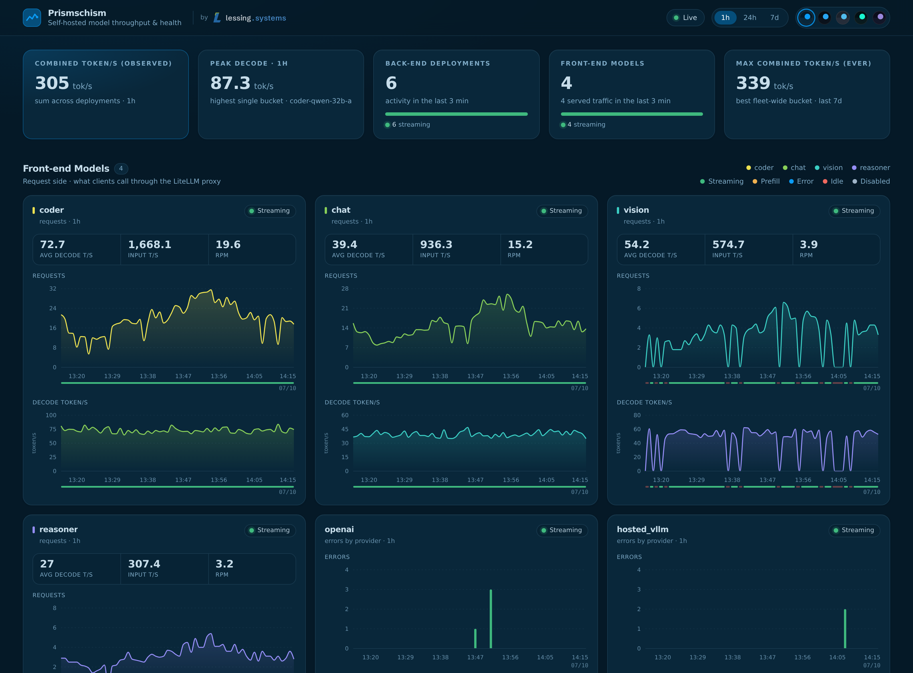

<h1 align="center">Prismschism</h1>
<p align="center">A live dashboard for your self-hosted <a href="https://github.com/BerriAI/litellm">LiteLLM</a> fleet: throughput, decode speed, request rates and backend health, per model and per deployment.</p>

<p align="center">
  
</p>

## Run it

You need Docker with Compose, and a LiteLLM proxy with its Prometheus metrics turned on (`litellm_settings: callbacks: ["prometheus"]` in your LiteLLM config).

**Just want to look around first?** No LiteLLM needed, this starts the UI with generated demo data:

```bash
git clone https://github.com/lessing-systems/prismschism.git && cd prismschism
MOCK_API=true docker compose up --build web
```

Then open <http://localhost:5173>.

### 1. Add your LiteLLM secrets

```bash
cp .env.example .env
```

Open `.env` and set:

| Variable | What to put there |
| --- | --- |
| `LITELLM_MASTER_KEY` | Your LiteLLM proxy key. Prismschism uses it to read `/metrics` and the deployment list (`/model/info`). It is only ever read from the environment, never stored in the repo. |
| `POSTGRES_PASSWORD` | Any password for the bundled database. Change it from the default. |

`.env` is git-ignored.

### 2. Point it at your proxy

Edit `config/targets.yaml` and set `url` to your proxy's metrics endpoint:

```yaml
backends:
  - name: primary
    url: http://your-litellm-host:4000/metrics/
    key_env: LITELLM_MASTER_KEY
```

You can list several proxies. Give each its own `name` and, if it uses a different key, its own `key_env` (and add that variable to `.env`).

### 3. Start it

```bash
docker compose up -d --build
```

Open <http://localhost:5173>.

- Your back-end deployments show up within about 15 seconds (the first scrape), because they are read from LiteLLM's model list. They sit at zero until they serve traffic.
- Front-end model cards and the token/s figures only appear once a model has actually been used. LiteLLM doesn't export metrics for a model until it handles a request, and Prismschism records changes between scrapes, so a request shows up one scrape (about 15 seconds) after it happens. If the dashboard looks empty, send a request through your proxy.
- Charts fill in as history accumulates.

### 4. Adjust docker-compose.yml (optional)

Everything below is in `docker-compose.yml` or `.env`:

- **Web port:** change `"5173:5173"` under `web.ports` to expose the dashboard on a different port.
- **Database access:** TimescaleDB is published on `127.0.0.1:5432` only. Remove the `ports` entry under `db` if you don't need host access.
- **Scrape-down threshold:** `SCRAPE_DOWN_AFTER_MS` (default 30000) is how long without a successful scrape before the dashboard shows the fleet as down.
- **Hide the "unassigned" card:** set `VITE_DEBUG=0` on the `web` service.
- **Cards per section:** `VITE_TOP_N` (max 20).
- **Tab icon:** set `FAVICON=` to your own icon URL or a file in `apps/web/public`, or `FAVICON=NONE` for no icon.
- **Remove the lessing.systems logo:** the header shows a small "by lessing.systems" credit. Set `SHOW_CREDIT=false` in `.env` (and `docker compose up -d` again) to hide it.

### The TTFT/ghost classifier

On every API start — and then on an interval (default: every 2 hours) — the API runs a small per-backend classifier. Over a rolling window it measures, for each deployment:

- **real hardware or ghost data:** the backend is counted as real only if it is in the deployment inventory with an actual endpoint. Metrics arriving for a model the roster has never seen (retired names, aliases, scrape artifacts) are classified as ghosts and excluded from every fleet rate and tile.
- **how much TTFT is hiding in its decode rate:** time-to-first-token is only reported for streaming calls, so a backend that also serves non-streaming requests keeps some prefill time inside its decode denominator, biasing its decode t/s low.

Backends whose estimated uncovered-TTFT share exceeds `TTFT_CORRECTION_THRESHOLD_PCT` (default **2**) get that share estimated out of their decode rates; everyone below stays untouched. The verdicts live in the `ttft_classification` table; a failed classifier run only delays the next correction, it never breaks the dashboard.

All knobs are environment variables on the `api` service in `docker-compose.yml` (defaults in parentheses):

| Variable | Meaning |
| --- | --- |
| `TTFT_CLASSIFIER_INTERVAL_MIN` | How often the classifier re-measures all backends (120 = every 2 hours). |
| `TTFT_CLASSIFIER_WINDOW_MIN` | How far back each measurement looks (1440 = 24 h). |
| `TTFT_CLASSIFIER_WATCH_S` | How often the roster is polled for new/updated models at LiteLLM (60); a change re-runs the classifier immediately. |
| `TTFT_CORRECTION_THRESHOLD_PCT` | Uncovered-TTFT share above which a backend's decode rates get corrected (2). Set very high (e.g. `1000000`) to disable correction entirely. |

## More

**What you get**

- Combined token/s across the fleet, the peak single-bucket decode rate, the highest combined rate seen in the last 7 days, and a wall-clock fleet aggregate.
- Per model group (LiteLLM's name for the public model clients call): requests, average decode t/s, input t/s, requests per minute, average end-to-end wall-clock seconds per request, and a live state (streaming, prefill, idle, error).
- Per back-end deployment: decode and input token rates, plus deployments that exist in LiteLLM but are idle.
- Errors by provider, with a banner when the scraper loses contact with your proxy.
- 1h / 24h / 7d ranges, five colour schemes, light and dark.

**How it works**

```
LiteLLM /metrics ──► scraper (Go) ──► TimescaleDB ──► API (Node) ──► web (React)
```

The scraper polls your proxy every ~15 seconds and stores counter deltas. The API derives rates at query time and runs the TTFT/ghost classifier on start and on an interval (see above). LiteLLM's own internal health-check traffic is dropped so it doesn't show up as phantom models.

**Notes on the numbers**

- *Decode t/s* is output tokens over time spent decoding (upstream latency minus time to first token), so it is a per-stream speed, not wall-clock throughput. Non-streaming calls bias it slightly low — the classifier measures that bias per backend and subtracts an estimate once it exceeds 2% of the backend's decode time.
- *Input t/s* is an input-token rate. It is not true prefill throughput.
- *Combined token/s (observed)* is measured throughput summed over deployments, not a rated maximum.
- *Fleet aggregate token/s* is all output tokens over wall-clock seconds — the concurrency-inclusive frame where prefill, queue and idle time count as seconds with no tokens. Every fleet rate excludes ghost data and unassigned groups; hover the ⓘ on a tile for its exact definition.
- *Wall-clock s* (on every back-end and front-end card) is the mean end-to-end seconds per request: queue, prefill, TTFT and decode all count. Smaller is better when agents are fanning out — every parallel branch waits on its own request, so the slowest branch gates the whole fan-out — but it also grows with task size, so compare backends on similar workloads. Hover the stat on any card for the same note.
- Retention: raw data 7 days, 1-minute rollups 30 days, 5-minute and 1-hour rollups 90 days.

**Backups:** `infra/db/backup.sh` and `infra/db/restore.sh` dump and restore the database.

**Development**

```bash
cd apps/web     && npm ci && npm test      # React / Vite
cd apps/api     && npm ci && npm test      # Node API
cd apps/scraper && go test ./...           # Go scraper
```

The compose setup runs the web app with the Vite dev server, which is fine for a private dashboard. Put it behind a reverse proxy with authentication before exposing it beyond your network, since the dashboard itself has no login.

## License

[MIT](LICENSE)
